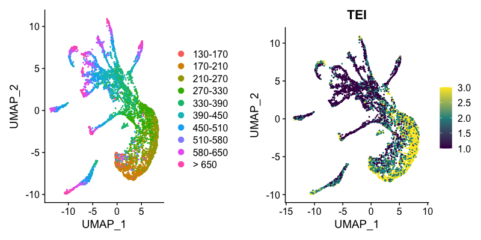
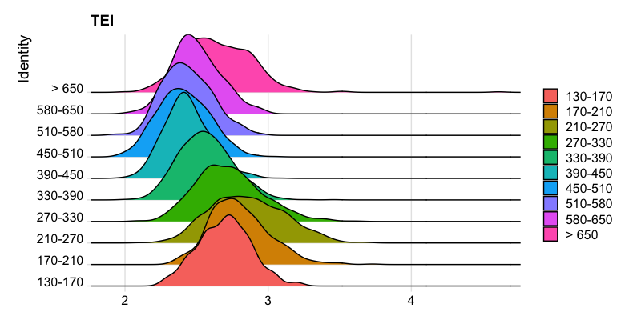
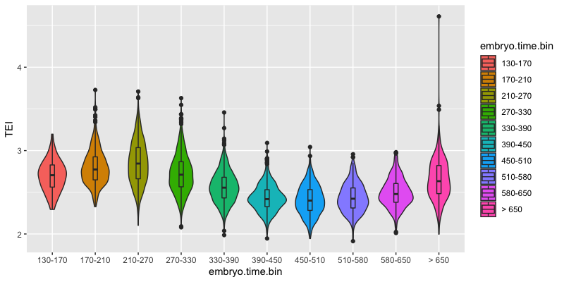
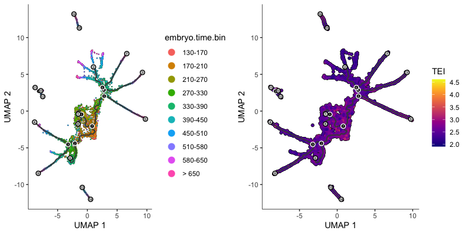
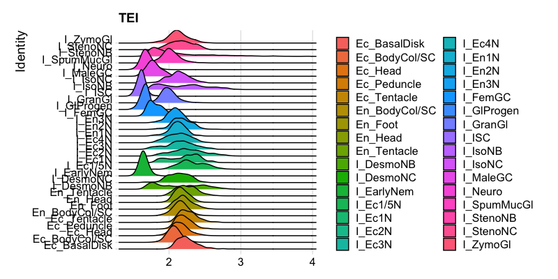
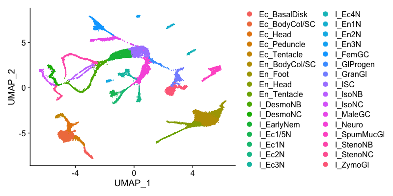
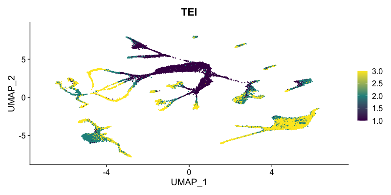
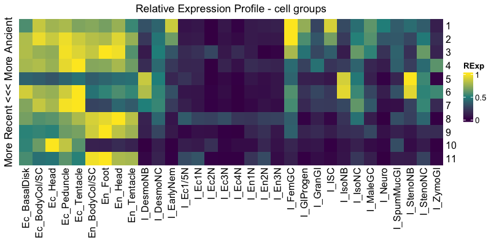

# scTEI <a href="https://github.com/kullrich/scTEI"></a>

scTEI - add any phylogenetically based transcriptome evolutionary index (TEI) to single-cell data objects
=====

# Introduction

The goal of `scTEI` is to provide easy functionality to add phylogenetically
based transcriptome evolutionary index (TEI) to single-cell data objects.

For a comprehensive overview about the topic of gene age assignments,
transcriptome age index (TAI) and its derivates (TDI, TPI, Adjusted SD,
PhastCons, ...) see e.g.:

- [myTAI - Introduction](https://drostlab.github.io/myTAI/articles/Introduction.html)
- TAI: ([Domazet-Lošo, Brajković, and Tautz 2007](https://doi.org/10.1016/j.tig.2007.08.014))
- TAI: ([Domazet-Lošo and Tautz 2010](https://doi.org/10.1038/nature09632))
- TDI: ([Quint et al. 2012](https://doi.org/10.1038/nature11394))
- TDI: ([Drost et al. 2017](https://doi.org/10.1093/molbev/msv012))
- TPI: ([Gossmann et al. 2016](https://doi.org/10.1093/molbev/msw044))
- Adjusted SD, PhastCons: ([Liu et al. 2020](https://doi.org/10.1186/s12915-020-00842-z))

__Note that prior calculating TEI one needs to retrieve phylogenetic or taxonomic information for your focal species.__

This might be a *phylostratigraphic map* (as introduced by Domazet-Lošo, Brajković, and Tautz 2007) or an *ortho map* (I call them, see e.g. Julca et al. 2021 or Cazet et al. 2022), which can be obtained by assigning to each orthogroup (OG) or hierachical orthogroup (HOG) along a given species tree the ancestral node.

Please have a look at the introduction of the great myTAI package for possible sources, how to get such *phylostratigraphic maps* ([myTAI - Introduction](https://drostlab.github.io/myTAI/articles/Introduction.html)).

To create an *ortho map*, one "simply" needs to get OGs or HOGs with e.g. OrthoFinder (Emms and Kelly 2019) or Proteinortho (Lechner et al. 2011) or any other ortholog prediction tool (see Linard et al. 2021) using a set of species that cover the species range of your interest. Parse each OG or HOG for the oldest clade as compared to a species tree and your focal species of interest.

Or e.g. use pre-calculated OGs from e.g. https://omabrowser.org/oma/home (Schneider, Dessimoz, and Gonnet 2007) or http://eggnog5.embl.de (Huerta-Cepas et al. 2019) or https://bioinformatics.psb.ugent.be/plaza/ for plants (Proost et al. 2009).

Example of *Caenorhabditis elegans*:

single-cell data: Packer and Zhu et al. 2019

ortho map: Sun et al. 2021



# Installation

see also here for the R package pages [https://github.com/kullrich/scTEI](https://github.com/kullrich/scTEI)

## R specific installation prerequisites

### install archived packages from cran, namely `Matrix.utils`

```
install.packages("https://cran.r-project.org/src/contrib/Archive/Matrix.utils/Matrix.utils_0.9.8.tar.gz", type="source", repos=NULL)
```

### install packages from [cran](https://cran.r-project.org/web/packages/index.html)

In most cases you need to first install the following system-wide packages to be able to compile the R dependencies.

Ubuntu/Debian

```
sudo apt-get install libcurl4-openssl-dev libssl-dev libxml2-dev libglu1-mesa-dev libgit2-dev
#pkgdown dependencies - pkgdown is used to build R package pages
#sudo apt-get install libssh2-1-dev libfontconfig1-dev libharfbuzz-dev libfribidi-dev libfreetype6-dev libpng-dev libtiff5-dev libjpeg-dev
```

CentOS

```
sudo yum install libcurl-devel openssl-devel libxml2-devel mesa-libGLU-devel libgit2-devel
#pkgdown dependencies - pkgdown is used to build R package pages
#sudo yum install libssh2-devel fontconfig-devel harfbuzz-devel fribidi-devel freetype-devel libpng-devel libtiff-devel libjpeg-turbo-devel
```

- [Rcpp](https://cran.r-project.org/web/packages/Rcpp/index.html)
- [RcppArmadillo](https://cran.r-project.org/web/packages/RcppArmadillo/index.html)
- [RcppThread](https://cran.r-project.org/web/packages/RcppThread/index.html)
- [devtools](https://cran.r-project.org/web/packages/devtools/index.html)
- [testthat](https://cran.r-project.org/web/packages/testthat/index.html)
- [dplyr](https://cran.r-project.org/web/packages/dplyr/index.html)
- [plyr](https://cran.r-project.org/web/packages/plyr/index.html)
- [ggplot2](https://cran.r-project.org/web/packages/ggplot2/index.html)
- [viridis](https://cran.r-project.org/web/packages/viridis/index.html)
- [cowplot](https://cran.r-project.org/web/packages/cowplot/index.html)
- [Seurat](https://cran.r-project.org/web/packages/Seurat/index.html)
- [SeuratData](https://cran.r-project.org/web/packages/SeuratData/index.html)
- [myTAI](https://cran.r-project.org/web/packages/myTAI/index.html)
- [magick](https://cran.r-project.org/web/packages/magick/index.html)

```
install.packages("Rcpp")
install.packages("RcppArmadillo")
install.packages("RcppThread")
install.packages("devtools")
install.packages("testthat")
install.packages("dplyr")
install.packages("plyr")
install.packages("ggplot2")
install.packages("viridis")
install.packages("cowplot")
install.packages("Seurat")
install.packages("SeuratData")
install.packages("myTAI")
install.packages("magick")
```

### install packages from [Bioconductor](https://www.bioconductor.org/)

- [BiocGenerics](https://bioconductor.org/packages/release/bioc/html/BiocGenerics.html)
- [DelayedArray](https://bioconductor.org/packages/release/bioc/html/DelayedArray.html)
- [DelayedMatrixStats](https://bioconductor.org/packages/release/bioc/html/DelayedMatrixStats.html)
- [limma](https://bioconductor.org/packages/release/bioc/html/limma.html)
- [S4Vectors](https://bioconductor.org/packages/release/bioc/html/S4Vectors.html)
- [SingleCellExperiment](https://bioconductor.org/packages/release/bioc/html/SingleCellExperiment.html)
- [SummarizedExperiment](https://bioconductor.org/packages/release/bioc/html/SummarizedExperiment.html)
- [batchelor](https://bioconductor.org/packages/release/bioc/html/batchelor.html)
- [ComplexHeatmap](https://bioconductor.org/packages/release/bioc/html/ComplexHeatmap.html)
- [org.Hs.eg.db](https://bioconductor.org/packages/release/bioc/html/org.Hs.eg.db.html)
- [org.Mm.eg.db](https://bioconductor.org/packages/release/bioc/html/org.Mm.eg.db.html)

```
if (!requireNamespace("BiocManager", quietly = TRUE))
    install.packages("BiocManager")

BiocManager::install(
    c(
    "BiocGenerics",
    "DelayedArray",
    "DelayedMatrixStats",
    "limma",
    "S4Vectors",
    "SingleCellExperiment",
    "SummarizedExperiment",
    "batchelor",
    "ComplexHeatmap",
    "org.Hs.eg.db",
    "org.Mm.eg.db")
)
```

### install [monocle3](https://cole-trapnell-lab.github.io/monocle3/docs/installation/)

```
devtools::install_github("cole-trapnell-lab/leidenbase")
devtools::install_github("cole-trapnell-lab/monocle3")
```

### install [scTEI](https://github.com/kullrich/scTEI)

```
library(devtools)
install_github("kullrich/scTEI", build_vignettes = TRUE, dependencies = TRUE)
```

## Quick-guide

### Seurat object

```
library(scTEI)

## get Seurat object
SeuratData::InstallData("celegans.embryo.SeuratData")
celegans <- SeuratData::LoadData("celegans.embryo")

## load Caenorhabditis elegans gene age estimation
celegans_ps <- readr::read_tsv(
    file = system.file("extdata",
    "Sun2021_Orthomap.tsv", package = "scTEI")
)
    
## define Phylostratum
ps_vec <- setNames(
    as.numeric(celegans_ps$Phylostratum),
    celegans_ps$GeneID
)

## add TEI values
celegans@meta.data["TEI"] <- TEI(
    ExpressionSet = celegans@assays$RNA@counts,
    Phylostratum = ps_vec
)

## Use multiple threads to calculate TEI on sparseMatrix
#celegans@meta.data["TEI"] <- TEI(
#    ExpressionSet = celegans@assays$RNA@counts,
#    Phylostratum = ps_vec,
#    split = 1000,
#    threads = 2
#)

## make RidgePlot
Seurat::Idents(celegans) <- "embryo.time.bin"
p1 <- Seurat::RidgePlot(
    object = celegans,
    features = "TEI"
)
p1

## preprocess scRNA
all.genes <- rownames(celegans)
celegans <- Seurat::NormalizeData(
    celegans,
    normalization.method = "LogNormalize",
    scale.factor = 10000) |>
    Seurat::FindVariableFeatures(selection.method = "vst",
    nfeatures = 2000) |>
    Seurat::ScaleData(features = all.genes) |>
    Seurat::RunPCA(dims=50) |>
    Seurat::RunUMAP(dims = 1:10)

## make FeaturePlot
p2 <- DimPlot(celegans)
p3 <- FeaturePlot(
    object = celegans,
    features = "TEI",
    min.cutoff='q05',
    max.cutoff='q95',
    cols = viridis::viridis(3)
)
cowplot::plot_grid(p2, p3)

## get relative expression per cell group
cell_groups <- Ident2cellList(Idents(celegans))
reM <- REMatrix(
    ExpressionSet = celegans@assays$RNA@counts,
    Phylostratum = ps_vec,
    groups = cell_groups,
    by = "row",
    threads = 2
)
p4 <- ComplexHeatmap::Heatmap(
    reM,
    name = "RExp",
    column_title = "Relative Expression Profile - cell groups",
    row_title = "More Recent <<< More Ancient",
    cluster_rows = FALSE,
    cluster_columns = FALSE,
    col = viridis::viridis(3)
)
p4
```

### Monocle3 object

```
library(scTEI)

## get Monocle3 object
expression_matrix <- readRDS(
    url(
    paste0("http://staff.washington.edu/hpliner/data/",
    "packer_embryo_expression.rds")
    )
)
cell_metadata <- readRDS(
    url(
    paste0("http://staff.washington.edu/hpliner/data/",
    "packer_embryo_colData.rds")
    )
)
gene_annotation <- readRDS(
    url(
    paste0("http://staff.washington.edu/hpliner/data/",
    "packer_embryo_rowData.rds")
    )
)
cds <- monocle3::new_cell_data_set(
    expression_data = expression_matrix,
    cell_metadata = cell_metadata,
    gene_metadata = gene_annotation
)

## load Caenorhabditis elegans gene age estimation
celegans_ps <- readr::read_tsv(
    file = system.file("extdata",
    "Sun2021_Orthomap.tsv", package = "scTEI")
)

## define Phylostratum
ps_vec <- setNames(
    as.numeric(celegans_ps$Phylostratum),
    celegans_ps$GeneID
)

## add TEI values
SummarizedExperiment::colData(cds)["TEI"] <- TEI(
    ExpressionSet = SingleCellExperiment::counts(cds),
    Phylostratum = ps_vec
)

## Use multiple threads to calculate TEI on sparseMatrix
#SummarizedExperiment::colData(cds)["TEI"] <- TEI(
#    ExpressionSet = SingleCellExperiment::counts(cds),
#    Phylostratum = ps_vec,
#    split = 1000,
#    threads = 2
#)

## make boxplot by embryo.time
p1 <- ggplot2::ggplot(
    data.frame(SummarizedExperiment::colData(cds)),
    ggplot2::aes(x=embryo.time.bin, y=TEI, fill=embryo.time.bin)) +
    ggplot2::geom_violin() +
    ggplot2::geom_boxplot(width=0.1)
p1

## preprocess scRNA
cds <- monocle3::preprocess_cds(cds, num_dim = 50)
cds <- monocle3::align_cds(cds, alignment_group = "batch",
    residual_model_formula_str = "~ bg.300.loading +
    bg.400.loading + bg.500.1.loading + bg.500.2.loading +
    bg.r17.loading + bg.b01.loading + bg.b02.loading")
cds <- monocle3::reduce_dimension(cds)
cds <- monocle3::cluster_cells(cds)
cds <- monocle3::learn_graph(cds)

## make FeaturePlot
p2 <- monocle3::plot_cells(cds,
    label_groups_by_cluster=FALSE,
    color_cells_by = "embryo.time.bin",
    group_label_size = 5,
    label_cell_groups = FALSE,
    label_leaves = TRUE,
    label_branch_points = TRUE,
    graph_label_size=1.5)
p3 <- monocle3::plot_cells(cds,
    label_groups_by_cluster=FALSE,
    color_cells_by = "TEI",
    group_label_size = 5,
    label_cell_groups = FALSE,
    label_leaves = TRUE,
    label_branch_points = TRUE,
    graph_label_size=1.5,
    cell_size = 1)
cowplot::plot_grid(p2, p3)
```

## Some examples

### Caenorhabditis elegans (Packer and Zhu et al. 2019, Sun et al. 2021)

single-cell data: Packer and Zhu et al. 2019

ortho map: Sun et al. 2021







### Hydra vulgaris (Cazet et al. 2022)

single-cell data: Cazet et al. 2022

ortho map: Cazet et al. 2022

```
library(scTEI)

## increase timeout - since download of 1.9 GB file
options(timeout=1000)

## get Seurat object
hvulgaris <- readRDS(
    url(
    paste0("https://research.nhgri.nih.gov/",
    "HydraAEP/download/scriptsdata/",
    "aepAtlasNonDub.rds")
    )
)

## re-order meta.data according to cell order
hvulgaris <- orderMetaData(
    seurat_obj = hvulgaris,
    seurat_data = hvulgaris@assays$SCT@data
)

## load Hydra vulgaris gene age estimation
hvulgaris_ps <- readr::read_tsv(
    file = system.file("extdata",
    "Cazet2022_Orthomap.tsv", package = "scTEI")
)
    
## define Phylostratum
ps_vec <- setNames(
    as.numeric(hvulgaris_ps$ageN),
    hvulgaris_ps$ID
)

## add TEI values
hvulgaris@meta.data["TEI"] <- TEI(
    ExpressionSet = hvulgaris@assays$SCT@data,
    Phylostratum = ps_vec,
    split = 1000,
    threads = 2
)

## make RidgePlot
Seurat::Idents(hvulgaris) <- "curatedIdent"
p1 <- Seurat::RidgePlot(
    object = hvulgaris,
    features = "TEI"
)
p1

## make FeaturePlot
p2 <- DimPlot(hvulgaris)
p2
p3 <- FeaturePlot(
    object = hvulgaris,
    features = "TEI",
    min.cutoff='q05',
    max.cutoff='q95',
    cols = viridis::viridis(3)
)
p3

## get relative expression per cell group
cell_groups <- Ident2cellList(Idents(hvulgaris))
reM <- REMatrix(
    ExpressionSet = hvulgaris@assays$SCT@data,
    Phylostratum = ps_vec,
    groups = cell_groups,
    by = "row",
    threads = 2
)
p4 <- ComplexHeatmap::Heatmap(
    reM,
    name = "RExp",
    column_title = "Relative Expression Profile - cell groups",
    row_title = "More Recent <<< More Ancient",
    cluster_rows = FALSE,
    cluster_columns = FALSE,
    col = viridis::viridis(3)
)
p4
```









## License

GPL-3 (see LICENSE)

## Contributing Code

If you would like to contribute to scTEI, please file an issue so that one can establish a statement of need, avoid redundant work, and track progress on your contribution.

Before you do a pull request, you should always file an issue and make sure that someone from the scTEI developer team agrees that it's a problem, and is happy with your basic proposal for fixing it.

Once an issue has been filed and we've identified how to best orient your contribution with package development as a whole, [fork](https://docs.github.com/en/github/getting-started-with-github/fork-a-repo) the [main repo](https://github.com/kullrich/scTEI.git), branch off a [feature branch](https://docs.github.com/en/github/collaborating-with-issues-and-pull-requests/about-branches) from `main`, [commit](https://docs.github.com/en/desktop/contributing-and-collaborating-using-github-desktop/committing-and-reviewing-changes-to-your-project) and [push](https://docs.github.com/en/github/using-git/pushing-commits-to-a-remote-repository) your changes to your fork and submit a [pull request](https://docs.github.com/en/github/collaborating-with-issues-and-pull-requests/proposing-changes-to-your-work-with-pull-requests) for `scTEI:main`.

By contributing to this project, you agree to abide by the Code of Conduct terms.

## Bug reports

Please report any errors or requests regarding [scTEI](https://github.com/kullrich/scTEI) to Kristian Ullrich (ullrich@evolbio.mpg.de)

or use the issue tracker at [https://github.com/kullrich/scTEI/issues](https://github.com/kullrich/scTEI/issues)

## Code of Conduct - Participation guidelines

This repository adhere to [Contributor Covenant](https://contributor-covenant.org) code of conduct for in any interactions you have within this project. (see [Code of Conduct](https://github.com/kullrich/scTEI/-/blob/main/CODE_OF_CONDUCT.md))

See also the policy against sexualized discrimination, harassment and violence for the Max Planck Society [Code-of-Conduct](https://www.mpg.de/11961177/code-of-conduct-en.pdf).

By contributing to this project, you agree to abide by its terms.

## References

Cao, Junyue, Malte Spielmann, Xiaojie Qiu, Xingfan Huang, Daniel M. Ibrahim, Andrew J. Hill, Fan Zhang et al. (2019) **The single-cell transcriptional landscape of mammalian organogenesis.** *Nature*, **566, no. 7745**. [https://doi.org/10.1038/s41586-019-0969-x](https://doi.org/10.1038/s41586-019-0969-x)

Cazet, Jack, Stefan Siebert, Hannah Morris Little, Philip Bertemes, Abby S. Primack, Peter Ladurner, Matthias Achrainer et al. (2022) **New Hydra genomes reveal conserved principles of hydrozoan transcriptional regulation.**, *bioRxiv*, **2022.06.21.496857**. [https://doi.org/10.1101/2022.06.21.496857](https://doi.org/10.1101/2022.06.21.496857)

Domazet-Lošo, Tomislav, Josip Brajković, and Diethard Tautz. (2007) **A Phylostratigraphy Approach to Uncover the Genomic History of Major Adaptations in Metazoan Lineages.** *Trends in Genetics*, **23, no.11**. [https://doi.org/10.1016/j.tig.2007.08.014](https://doi.org/10.1016/j.tig.2007.08.014)

Domazet-Lošo, Tomislav, and Diethard Tautz. (2010) **A phylogenetically based transcriptome age index mirrors ontogenetic divergence patterns.** *Nature*, **468, no. 7325**. [https://doi.org/10.1038/nature09632](https://doi.org/10.1038/nature09632)

Drost, Hajk-Georg, Alexander Gabel, Ivo Grosse, and Marcel Quint. (2015) **Evidence for active maintenance of phylotranscriptomic hourglass patterns in animal and plant embryogenesis.** *Molecular biology and evolution*, **32, no. 5**. [https://doi.org/10.1093/molbev/msv012](https://doi.org/10.1093/molbev/msv012)

Emms, David M, and Steven Kelly. (2019) **OrthoFinder: Phylogenetic Orthology Inference for Comparative Genomics.** *Genome Biology*, **20, no. 1**. [https://doi.org/10.1186/s13059-019-1832-y](https://doi.org/10.1186/s13059-019-1832-y)

Gossmann, Toni I, Dounia Saleh, Marc W Schmid, Michael A Spence, and Karl J Schmid. (2016) **Transcriptomes of Plant Gametophytes Have a Higher Proportion of Rapidly Evolving and Young Genes Than Sporophytes.** *Molecular Biology and Evolution*, **33, no. 7**. [https://doi.org/10.1093/molbev/msw044](https://doi.org/10.1093/molbev/msw044)

Julca, Irene, Camilla Ferrari, Marı́a Flores-Tornero, Sebastian Proost, Ann-Cathrin Lindner, Dieter Hackenberg, Lenka Steinbachová, et al. (2021) **Comparative Transcriptomic Analysis Reveals Conserved Programmes Underpinning Organogenesis and Reproduction in Land Plants.** *Nature Plants*, **7, no. 8**. [https://doi.org/10.1038/s41477-021-00958-2](https://doi.org/10.1038/s41477-021-00958-2)

Lechner, Marcus, Sven Findeiß, Lydia Steiner, Manja Marz, Peter F Stadler, and Sonja J Prohaska. (2011) **Proteinortho: Detection of (Co-) Orthologs in Large-Scale Analysis.** *BMC Bioinformatics*, **12, no. 1**. [https://doi.org/10.1186/1471-2105-12-124](https://doi.org/10.1186/1471-2105-12-124)

Linard, Benjamin, Ingo Ebersberger, Shawn E McGlynn, Natasha Glover, Tomohiro Mochizuki, Mateus Patricio, Odile Lecompte, et al. (2021) **Ten Years of Collaborative Progress in the Quest for Orthologs.** *Molecular Biology and Evolution*, **38, no. 8**. [https://doi.org/10.1093/molbev/msab098](https://doi.org/10.1093/molbev/msab098)

Liu, Jialin, Michael Frochaux, Vincent Gardeux, Bart Deplancke, and Marc Robinson-Rechavi. (2020) **Inter-Embryo Gene Expression Variability Recapitulates the Hourglass Pattern of Evo-Devo.** *BMC Biology*, **18, no. 1**. [https://doi.org/10.1186/s12915-020-00842-z](https://doi.org/10.1186/s12915-020-00842-z)

Packer, Jonathan S., Qin Zhu, Chau Huynh, Priya Sivaramakrishnan, Elicia Preston, Hannah Dueck, Derek Stefanik et al. (2019) **A lineage-resolved molecular atlas of C. elegans embryogenesis at single-cell resolution.** *Science*, **365, no. 6459**. [https://doi.org/10.1126/science.aax1971](https://doi.org/10.1126/science.aax1971)

Proost, Sebastian, Michiel Van Bel, Lieven Sterck, Kenny Billiau, Thomas Van Parys, Yves Van de Peer, and Klaas Vandepoele. (2009) **PLAZA: A Comparative Genomics Resource to Study Gene and Genome Evolution in Plants.** *The Plant Cell*, **21 no. 12**. [https://doi.org/10.1105/tpc.109.071506](https://doi.org/10.1105/tpc.109.071506)

Quint, Marcel, Hajk-Georg Drost, Alexander Gabel, Kristian Karsten Ullrich, Markus Bönn, and Ivo Grosse. (2012) **A transcriptomic hourglass in plant embryogenesis.** *Nature*, **490, no. 7418**. [https://doi.org/10.1038/nature11394](https://doi.org/10.1038/nature11394)

Satija, Rahul, Jeffrey A. Farrell, David Gennert, Alexander F. Schier, and Aviv Regev. (2015) **Spatial reconstruction of single-cell gene expression data.** *Nature biotechnology*, **33, no. 5**. [https://doi.org/10.1038/nbt.3192](https://doi.org/10.1038/nbt.3192)

Schneider, Adrian, Christophe Dessimoz, and Gaston H Gonnet. (2007) **OMA Browser—Exploring Orthologous Relations Across 352 Complete Genomes.** *Bioinformatics*, **23, no. 16**. [https://doi.org/10.1093/bioinformatics/btm295](https://doi.org/10.1093/bioinformatics/btm295)

Sun, Shuai, Christian Rödelsperger, and Ralf J Sommer. (2021) **Single Worm Transcriptomics Identifies a Developmental Core Network of Oscillating Genes with Deep Conservation Across Nematodes.** *Genome Research*, **31, no. 9**. [https://doi.org/10.1101/gr.275303.121](https://doi.org/10.1101/gr.275303.121)
